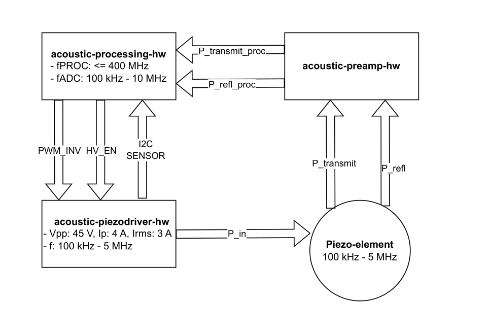

# acoustic-emissions-hw
Repository for my non-destructive mechanical measurement device.

## Project Goal
Being able to measure cracks and holes in welds and solid materials by measuring mechanical wave behavior in the material.

## Description
The project will consist of 3 boards
- acoustic-processing-hw (The compute-module)
- acoustic-preamp-hw (The preamp-module)
- acoustic-piezodriver-hw (The driver-module)

## The electronics demistified

The **compute**-module will drive a PWM signal to the **driver**-module. The **driver** contains various DC-DC converters, along with a single-phase inverter. 

The inverter-output is connected to a piezo-element, driving the piezo-element with a 0.1 MHz - 10 MHz block-wave at an amplitude of 40 V, and currents up to 3 A RMS. Optional piezo-specific band-pass filters might be integrated.

The "transmitting" piezo-element and "receiving" piezo-element are connected to the **preamp** board, capable of
- Measuring transmitted power through the sending piezo.
- Measuring reflections back into the sending piezo (due to e.g.: mechanical impedance discontinuities between sending and receiving piezo).
- Measuring received power at the receiving piezo.

The **preamp** board will likely be covering only part of the 0.1-10 MHz frequency band. After some active filtering on the **preamp**-board, the signal is passed onto the front-end present on the **processing**-board. The **processing** board buffers the signal coming from the **preamp** and samples it with 10-bit accuracy at maximum 35 MHz.

## The mechanics demistified
#### Initial piezo-choice
The initial test-piezo used is the [UB161M7](https://www.mouser.de/datasheet/2/334/UB161M7-953231.pdf), which has a resonance frequency of 1.70 MHz.

#### Isotropic behavior
In order to get the best possible results, in terms of wave propagation insights and material properties. Ideally isotropic materials are used. Anisotropic materials will likely require lots of calibration and specific digital processing.

#### Piezo resonance frequency
In order to pass on vibration from the piezo onto the material, it's imperative to match their acoustic impedances. This will likely dampen the resonance curve, and shift the resonance frequency of the piezo.

